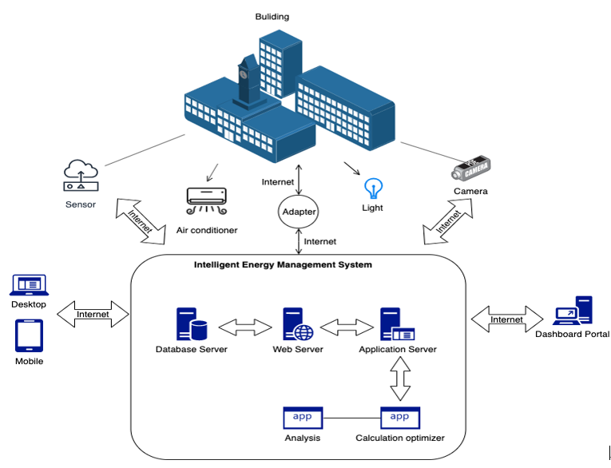

## 
International STEM Students' Forum 2020 Collaboration Project

*
 Intelligent Energy Management System for Buildings 
*

&nbsp;

### System Architecture

&nbsp;

1. Retrieval of regional weather data from the existing OpenAPI (OpenWeatherMap), storing to DB for further analysis;

2. Retrieval of outdoor weather data through several IoT devices installed outside the building, storing to DB for further analysis;

3. Retrieval of indoor conditions through several IoT devices installed inside the rooms of the building;

4. Device control of lights and temperature, change based on the analyzed regional and outdoor weather data, as well as indoor sensors and system rules.

5. Dashboard interface for authorized users to view the building conditions and manage rules, with import of timetable from existing system(s).

&nbsp;

### General Summary and Tasks

&nbsp;

|    |    | Functional Requirements           | HW/SW/OpenAPI            | HK Team | UK Team | Status   |
|----|----|-----------------------------------|--------------------------|---------|---------|----------|
| A. |    | Regional Weather Data             |                          |         |         |          |
|    | A1 | Capture weather data from API     | OpenWeatherMap           |    X    |         |  Done    |
|    | A2 | Store the historical data to DB   | Azure Cosmos DB / MongoDB |    X    |         | Done     |
| B. |    | Outdoor Weather Nearby building   |                          |         |         |          |
|    | B1 | Design Sensors for data retrieval | Raspberry PI / Arduino   |         |         |          |
|    | B2 | Export Sensors data to DB         | Azure Cosmos DB / MongoDB |    X    |         |          |
| C. |    | Indoor Condition                  |                          |         |         |          |
|    | C1 | Design Sensors for data retrieval | Raspberry PI / Arduino   |    X    |         |          |
|    | C2 | Export Sensors data to DB         | Azure Cosmos DB / MongoDB |    X    |         |          |
|    | C3 | Electronics Components controls   | Raspberry PI / Arduino   |    X    |         |          |
| D. |    | Dashboard                         |                          |         |         |          |
|    | D1 | Display real time condition       | .NET Core                |         |         |          |
|    | D2 | Rule-based condition management   | .NET Core                |         |         |          |
|    | D3 | Timetable import (API)            |                          |         |         |          |
|    |    |           Excel to JSON           |                          |         |    X    |          |
|    |    |            ICS to JSON            |                          |         |    X    |          |
|    |    |            CSV to JSON            |                          |         |    X    |          |
|    | D4 | Intelligence condition control    | IBM PowerAI              |         |         |          |
|    |    |              By rule              |                          |    X    |         |          |
|    |    |            By timetable           |                          |    X    |         |          |
